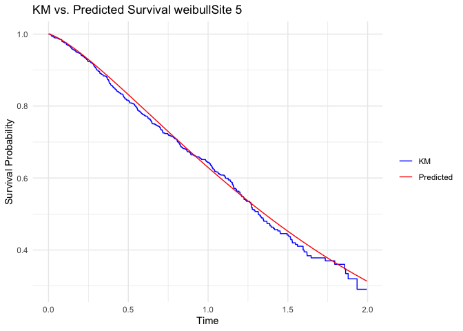
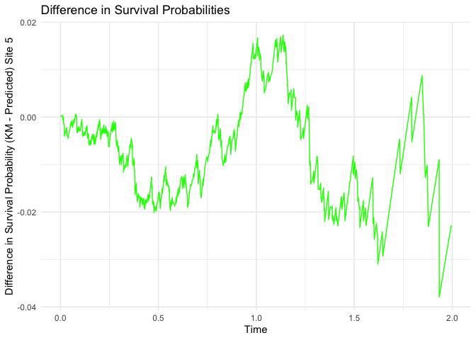

### A package for Privacy enhanced collaborative inference in the Cox proportional hazards model for distributed data

#### Mengtong Hu

#### 2024-06-19

This is a tutorial for using the CAFTA package designed for analyzing
distributed survival data.

# Install Pacakges

    devtools::install("/Users/humengtong/University of Michigan Dropbox/Mengtong Hu/project3/CAFTA")

    ## ── R CMD build ─────────────────────────────────────────────────────────────────
    ##      checking for file ‘/Users/humengtong/University of Michigan Dropbox/Mengtong Hu/project3/CAFTA/DESCRIPTION’ ...  ✔  checking for file ‘/Users/humengtong/University of Michigan Dropbox/Mengtong Hu/project3/CAFTA/DESCRIPTION’
    ##   ─  preparing ‘CAFTA’:
    ##      checking DESCRIPTION meta-information ...  ✔  checking DESCRIPTION meta-information
    ##   ─  excluding invalid files
    ##      Subdirectory 'R' contains invalid file names:
    ##      ‘README.Rmd’ ‘README.md’
    ##   ─  checking for LF line-endings in source and make files and shell scripts
    ##   ─  checking for empty or unneeded directories
    ##    Omitted ‘LazyData’ from DESCRIPTION
    ##   ─  building ‘CAFTA_0.1.0.tar.gz’
    ##      
    ## Running /Library/Frameworks/R.framework/Resources/bin/R CMD INSTALL \
    ##   /var/folders/nd/kjvg8z8x2590856v0mc3ms6c0000gn/T//RtmpvSDvJC/CAFTA_0.1.0.tar.gz \
    ##   --install-tests 
    ## * installing to library ‘/Library/Frameworks/R.framework/Versions/4.1-arm64/Resources/library’
    ## * installing *source* package ‘CAFTA’ ...
    ## ** using staged installation
    ## ** R
    ## ** byte-compile and prepare package for lazy loading
    ## ** help
    ## *** installing help indices
    ## ** building package indices
    ## ** testing if installed package can be loaded from temporary location
    ## ** testing if installed package can be loaded from final location
    ## ** testing if installed package keeps a record of temporary installation path
    ## * DONE (CAFTA)

    #devtools::install_github("https://github.com/CollaborativeInference/CAFTA") 
    #> ℹ Loading colsa
    library(survival)

# simaftweibull() : simulate datasets

In the simulation, we considered 2 continuous covariates and 2
categorical covaraites. The continuous covariates are generated from a
bivariate normal distribution. The first categorical covariate is
generated from a Bernoulli distribution and the second categorical with
4 classes is generated from a multinomial distribution with
probabilities depending on the two levels of the first categorical
covariate. The event times are generated from the AFT model
log (*T*) = *α* + *X**T**β* + *σ**W*.
A Weibull AFT model is given by
*f*(*w*) = *e**w* − *e**w*, a log-logistic model
is given by
*f*(*w*) = *e**w*(1+*e**w*)−2, and the
log-normal regression model is
*f*(*w*) = (2*π*)−1/2*e*−*w*2/2. We
aimed to generate 6 datasets with 1050 observations and then randomly
split the generated data into 500,300,100,50,50, and 50 observations.
The available distribution options for generating the event times are
“weibull”, “loglogistic”, and “lognormal”.

    library(CAFTA)
    library(MASS)
    library(extRemes)

    ## Loading required package: Lmoments

    ## Loading required package: distillery

    ## 
    ## Attaching package: 'extRemes'

    ## The following objects are masked from 'package:stats':
    ## 
    ##     qqnorm, qqplot

    type = "weibull"
    ns = c(500,300,100,50,50,50)
    K = length(ns)
          truev = c(0.15,-0.15,0.3,0.1,-0.1,0.3)

    data <- simaft(N =sum(ns),scale = 0.8, location =  0.3, beta=truev, rateC=2,ad_C = 10,type,censoring_type = "uniform")

Randomly split the generated data into 6 datasets.

    group_indicator = c()
    for(k in c(1:(K))){
        group_indicator= c(group_indicator,rep(k,ns[k]))
      }
    # The CoxPH regression formula  
    form =as.formula(paste("Surv(time, status)", paste(names(data)[4:length(names(data))],collapse="+"), sep = " ~ "))
    data$group = group_indicator
    data$order = data$group

# A quick demo using CAFTA\_update\_optimx on the generated data. Use survreg function to get the initial value and find the CAFTA estimate using the generated data over the six sites.

# The dist option can be “weibull”, “loglogistic”, “lognormal”, and “gengamma”.

    data_first = subset(data,order==1)

    survregWei<-  survreg(form, data_first,
                                 dist = "weibull")
        
    init_val = c(survregWei$coefficients,survregWei$scale)
    npar = 6
    res = CAFTA_update_optimx(6,data, "weibull",init = init_val,p=8)

# Plot the estimated survival curve.

Once we obtained the CAFTA estimate, we can construct the survival
curves for any covariates values. Here we plot the survival curve for an
indiviudal with average covariates and compare it with the KM survival
curves.

    library(ggplot2)
    library(dplyr)

    ## 
    ## Attaching package: 'dplyr'

    ## The following object is masked from 'package:MASS':
    ## 
    ##     select

    ## The following objects are masked from 'package:stats':
    ## 
    ##     filter, lag

    ## The following objects are masked from 'package:base':
    ## 
    ##     intersect, setdiff, setequal, union

    plot_survival_curve_for_renew(data,res,5,"weibull")

    ## $a

    ## 
    ## $b

