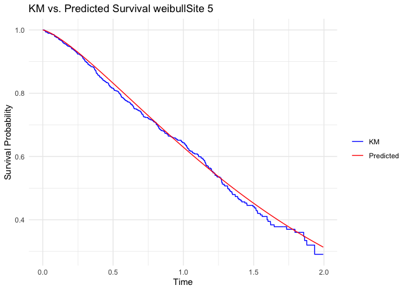
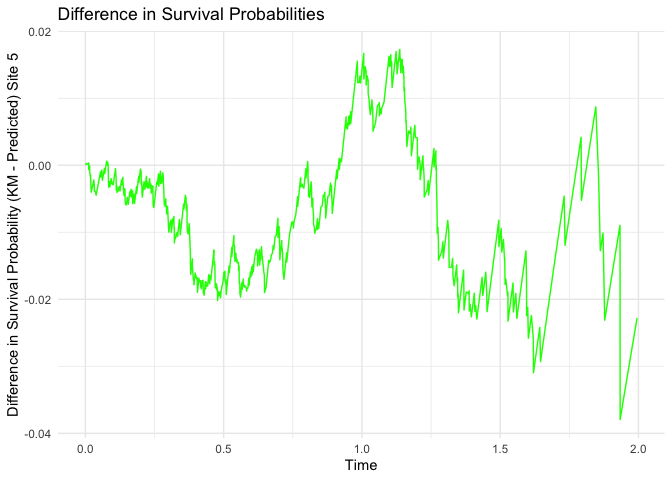

### A package for ollaborative inference in the Accelerated Failure Time (AFT) model for distributed data

#### Mengtong Hu

#### 2024-08-24

This is a tutorial for using the CAFTA package designed for analyzing
distributed survival data.

# Install Pacakges

    devtools::install_github("https://github.com/CollaborativeInference/CAFTA") 
    library(survival)

# simaftweibull() : simulate datasets

In the simulation, we considered 2 continuous covariates and 2
categorical covaraites. The continuous covariates are generated from a
bivariate normal distribution. The first categorical covariate is
generated from a Bernoulli distribution and the second categorical with
4 classes is generated from a multinomial distribution with
probabilities depending on the two levels of the first categorical
covariate. The event times are generated from the AFT model
log (*T*) = *α* + *X**T**β* + *σW*.
A Weibull AFT model is given by
*f*(*w*) = *e**w* − *e**w*, a log-logistic model
is given by
*f*(*w*) = *e**w*(1+*e**w*)−2, and the
log-normal regression model is
*f*(*w*) = (2*π*)−1/2*e*−*w*2/2. We
aimed to generate 6 datasets with 1050 observations and then randomly
split the generated data into 500,300,100,50,50, and 50 observations.
The available distribution options for generating the event times are
“weibull”, “loglogistic”, and “lognormal”.

    library(CAFTA)
    library(MASS)
    library(extRemes)
    type = "weibull"
    ns = c(500,300,100,50,50,50)
    K = length(ns)
          truev = c(0.15,-0.15,0.3,0.1,-0.1,0.3)

    data <- simaft(N =sum(ns),scale = 0.8, location =  0.3, beta=truev, rateC=2,ad_C = 10,type,censoring_type = "uniform")

Randomly split the generated data into 6 datasets.

    group_indicator = c()
    for(k in c(1:(K))){
        group_indicator= c(group_indicator,rep(k,ns[k]))
      }
    # The CoxPH regression formula  
    form =as.formula(paste("Surv(time, status)", paste(names(data)[4:length(names(data))],collapse="+"), sep = " ~ "))
    data$group = group_indicator
    data$order = data$group

# A quick demo using CAFTA\_update\_optimx on the generated data.
 Use survreg function to get the initial value and find the CAFTA estimate using the generated data over the six sites.

 The `dist` option can be “weibull”, “loglogistic”, “lognormal”, and “gengamma”.

    data_first = subset(data,order==1)

    survregWei<-  survreg(form, data_first,
                                 dist = "weibull")
        
    init_val = c(survregWei$coefficients,survregWei$scale)
    npar = 6
    res = CAFTA_update_optimx(6,data, "weibull",init = init_val,p=8)

# Plot the estimated survival curve.

Once we obtained the CAFTA estimate, we can construct the survival
curves for any covariates values. Here we plot the survival curve for an
indiviudal with average covariates and compare it with the KM survival
curves.

    library(ggplot2)
    library(dplyr)

    plot_survival_curve_for_renew(data,res,5,"weibull")

    ## $a

    ## 
    ## $b

